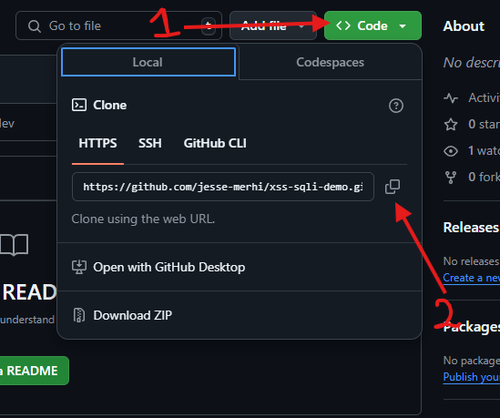
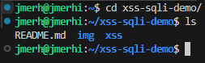

# XSS and SQLI Demo

This repository contains an introductory demo to Cross-Site Scripting (XSS) and SQL Injection SQLI.

## Pre-requisites
1. Install git from [this website](https://git-scm.com/downloads).
2. Follow [this guide](https://realpython.com/installing-python/) to install Python3.
3. Install pipenv from [here](https://pipenv.pypa.io/en/latest/installation.html).

## Using this repository on codespaces


## Using this repository on your machine
1. Press "Code" in the top right of the repository interface.
2. Press the copy to clipboard button next to the HTTPS URL.
   
<p align="center">

</p>

3. Go to your "Terminal" app (MacOS), "Command Prompt" app (Windows) or Shell (Linux) and type this command,
```bash
git clone <paste_url_here>
```
After each command make sure to press enter!

4. You should now have the whole repository downloaded locally and ready to use! If you enter `cd xss-sqli-demo` into your terminal to go inside the repository folder and then `ls` you should see all of the downloaded files.

<p align="center">

</p>

## What next?

From here feel free to find this folder and open it in your favourite Integrated Development Environment (IDE) like VSCODE, Pycharm etc. 

Then simply open up the folder for the topic you want to demo and read the `README` for more information.
